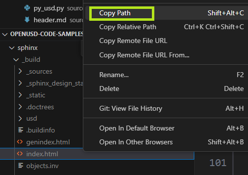

# Code Sample Guidelines


# Samples Format

This image shows the file structure that contains two Code Samples for cameras. 


Our Code Samples are stored in the source directory, organized by categories. Each sample has their files, including the actual sample code, in their own directory.

In this example, we have two camera Code Samples. The paths to these two Code Samples folders are the following:

`source/cameras/create-orthographic-camera`
`source/cameras/create-perspective-camera`

**Within each Code Sample folder are the following files:**

| File(s) | Purpose |
| -----|----- |
| config.toml | Contains the title, metadata: description and SEO keywords |
| header.md | The overview for this code sample |
| Code Sample "flavor" file(s) | See below |
| Markdown file for each "flavor" | See below |


The header file is an overview for all of the flavors. It can contain markdown formatting including URL's and markdown directives.

**Each Code Sample should have at least one "flavor":**

| Flavor Source File Name | Language and USD type |
| -----|----- |
| py_usd.py | Python using Pixar USD API |
| py_omni_usd.py | Python using omni.usd extension |
| py_kit_cmds.py | Python using Kit commands |
| cpp_usd.cpp | C++ using Pixar USD API |
| cpp_omni_usd.cpp | C++ using omni.usd extension |
| cpp_kit_cmds.cpp | C++ using Kit commands |
| usda.usda | USDA (text) file |

Each flavor can have more than one sample (variations). In this case we append _var< X >, where X starts with 1 and increments for as many sample variations needed.

Example: `py_usd.py`, `py_usd_var1.py`, `py_usd_var2.py `, etc...

**Markdown files:**

Every flavor that has a sample needs exactly one markdown file, no matter how many variations are included. They will have the same name as the flavor, but with the .md extension.

Example, if you have some `py_usd.py` samples you'll need a `py_usd.md` file. In the markdown file you'll need to use the `literalinclude` directive.

Example:
```
    **Convert to Numpy Array**

    To convert a VtArray to a Numpy Array, simply pass the VtArray object to `numpy.array` constructor.

    ``` {literalinclude} py_usd.py
    :language: py
    ```

    **Convert from Numpy Array** 

    To convert a Numpy Array to a VtArray, you can use `FromNumpy()` from the VtArray class you want to convert to.

    ``` {literalinclude} py_usd_var1.py
    :language: py
    ``` 
```

This example includes two samples, with a description for each one.

 
| Language code | File type |
| -----|----- |
| py | Python |
| c++ | C++/cpp |
| usd | USDA |


# Building the Samples

When all of your files are in place you should build and verify your samples are correctly setup by running the build script:

```
>python build.py
```

If there are no errors, you can then view it by loading the ``index.html`` file, in the ``sphinx/_build folder``, in a browser. 


There are two ways to do this. The first way: 
1) Select the ``index.html`` file
2) Right click and select ``Copy Path`` 
3) Paste the path into address bar of your web browser  


The second way:
1) select the ``index.html`` file so it's showing in a VS Code window
2) Press ``Alt-B`` and it will be launched in your default web browser.


#URL links

Use markdown style links

    [USD Data Types documentation](https://docs.omniverse.nvidia.com/dev-guide/latest/dev_usd/quick-start/usd-types.html) 


#Embeded RST


## Admonitions

https://myst-parser.readthedocs.io/en/latest/syntax/admonitions.html
    
    :::{tip}
    https://myst-parser.readthedocs.io/en/latest/syntax/admonitions.html
    :::


---

